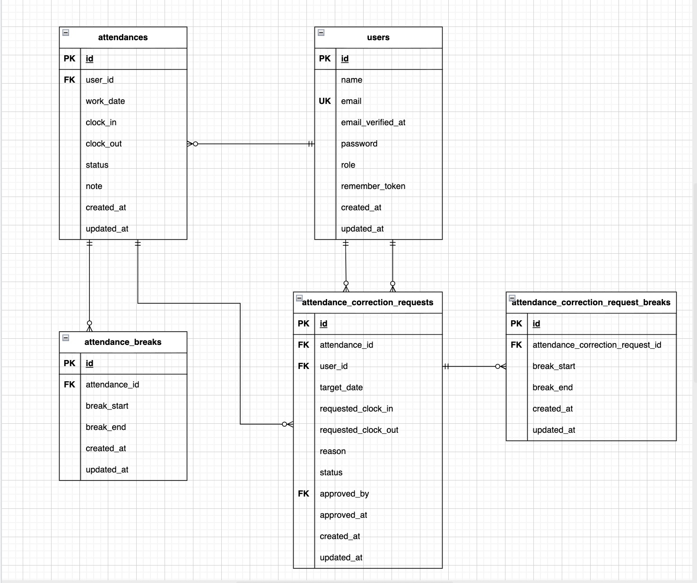

# coachtech 勤怠管理アプリ

## 環境

- PHP 8系
- Laravel 8.75
- MySQL 8.0.26
- Nginx 1.21.1
- phpMyAdmin
- Mailhog

## 環境構築手順

以下の手順で、環境構築からマイグレーションまで実行できます。

### 1. リポジトリをクローンする

```bash
git clone https://github.com/S-Uchiyama/test-attendance.git
```

### 2. ルートディレクトリへ移動する

```bash
cd test-attendance
```

### 3. Docker コンテナを起動する

```bash
docker compose up -d --build
```

### Warning

Mac（M1 / M2 チップ）を利用している場合、ビルド時に `no matching manifest for linux/arm64/v8` が表示されることがあります。  
その場合は `docker-compose.yml` の `mysql` に `platform` を指定してください。

```yml
mysql:
    image: mysql:8.0.26
    platform: linux/x86_64 # ←この行を追加
    environment:
```

### 4. PHP コンテナに入る

```bash
docker compose exec php bash
cd /var/www
```

### 5. Laravel 依存パッケージをインストールする

```bash
composer install
```

### 6. 環境変数ファイルを作成し、必要な値を設定する

```bash
cp .env.example .env
```

`.env` には以下の値を設定してください。

```env
APP_NAME=Laravel
APP_ENV=local
APP_KEY=
APP_DEBUG=true
APP_URL=http://localhost
SESSION_SECURE_COOKIE=false

DB_CONNECTION=mysql
DB_HOST=mysql
DB_PORT=3306
DB_DATABASE=laravel_db
DB_USERNAME=laravel_user
DB_PASSWORD=laravel_pass

MAIL_MAILER=smtp
MAIL_HOST=mailhog
MAIL_PORT=1025
MAIL_USERNAME=null
MAIL_PASSWORD=null
MAIL_ENCRYPTION=null
MAIL_FROM_ADDRESS=no-reply@example.com
MAIL_FROM_NAME="coachtech 勤怠管理アプリ"
```

### 7. アプリケーションキーを生成する

```bash
php artisan key:generate
```

### 8. マイグレーションを実行する

```bash
php artisan migrate
```

### 9. ダミーデータを投入する

以下を実行すると、管理者ユーザー、一般ユーザー、勤怠データ、修正申請データを投入できます。

```bash
php artisan db:seed
```

## ダミーユーザー

### 管理者ユーザー

- メールアドレス: `admin@example.com`
- パスワード: `password123`
- ログイン URL: `http://localhost/admin/login`

### 一般ユーザー

- メールアドレス: `user1@example.com`
- パスワード: `password123`
- ログイン URL: `http://localhost/login`

補足:
- `user2@example.com / password123`
- `user3@example.com / password123`

## ER図



## 画面確認 URL

- アプリ: `http://localhost`
- phpMyAdmin: `http://localhost:8080`
- Mailhog: `http://localhost:8025`

## メール認証確認手順

1. 会員登録を実行する
2. Mailhog で認証メールを確認する
3. メール内のリンクを開く
4. 勤怠登録画面に遷移すれば認証完了

## テスト実行

```bash
docker compose exec php bash
cd /var/www
php artisan test --testdox
```
